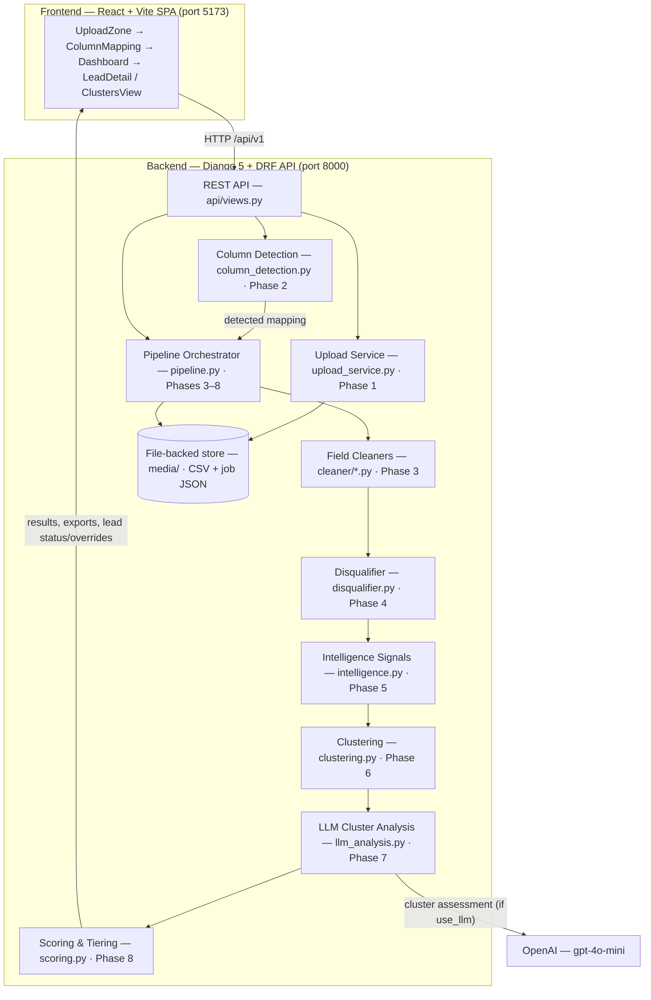

# Lead Triage System

Upload a messy lead CSV and the pipeline detects columns, cleans every field,
flags/disqualifies bad leads, clusters similar ones, and scores the rest into
actionable tiers — with optional LLM cluster analysis.

## Architecture



### Components

**`frontend/` — React + Vite SPA**
Single-page app that walks the user through the flow: upload a CSV
(`UploadZone`), review the detected columns (`ColumnMapping`), then run and
inspect the pipeline (`Dashboard`, `LeadDetail`, `ClustersView`,
`DisqualifiedView`). Talks to the backend over HTTP at `/api/v1` (Vite proxies
`/api` to port 8000 in dev). Supports LLM vs heuristic analysis mode,
per-lead actions (copy / share / skip / mark contacted), and inline field
editing.

**`backend/` — Django 5 + DRF API**
Everything is file-backed — no external database required. State lives as JSON
under `media/`. The API exposes upload, mapping confirmation, processing,
results, leads, clusters, lead status/overrides, and CSV/JSON exports.

- **`api/`** — Django app with the REST endpoints (`views.py`, `urls.py`).
- **`triage/upload_service.py`** — Phase 1. Validates the file (type, size,
  binary sniffing), detects encoding, parses the CSV, persists it under
  `media/uploaded/`, and returns a preview + `job_id`.
- **`triage/column_detection.py`** — Phase 2. Maps each CSV header to a
  canonical field (exact / case-insensitive / fuzzy / no-match), honoring user
  overrides.
- **`triage/pipeline.py`** — Orchestrator tying Phases 3–8 together. Runs the
  cleaners per row, applies user field overrides, calls the disqualifier,
  clusters, analyzes, scores, and persists the `PipelineReport` to the job.
- **`triage/cleaner/*.py`** — Phase 3. Per-field standardization: names,
  emails, companies (incl. slug-based dedup), titles, budgets, employees,
  websites, sources, dates, lead ids, and free-text notes (paragraph counts,
  language, sentiment, spam/flag detection).
- **`triage/disqualifier.py`** — Phase 4. Rule-based triage to `QUALIFIED`,
  `DISQUALIFIED`, or `LOW_PRIORITY` (spam, wrong fit, competitors,
  non-decision-makers, etc.).
- **`triage/intelligence.py`** — Phase 5. Pre-LLM signal extraction (budget,
  timeline, authority, use-case clarity, company fit, notes quality).
- **`triage/clustering.py`** — Phase 6. Groups similar qualified leads so one
  LLM call covers a whole cluster instead of 40+ individual calls.
- **`triage/llm_analysis.py`** — Phase 7. Analyzes 2–3 representatives per
  cluster with `gpt-4o-mini`. Degrades to deterministic heuristics when no API
  key is set, and tracks estimated cost per cluster.
- **`triage/scoring.py`** — Phase 8. Applies cluster insights, computes
  individual adjustments, ranks leads, and buckets them into TIER1–TIER5 with
  an executive tier summary.

**OpenAI** — optional external dependency for cluster-level analysis. No API
key → the pipeline runs entirely on heuristics (zero cost, instant).

## Setup

### Backend

```powershell
cd backend
python -m venv .venv
.\.venv\Scripts\Activate.ps1
pip install -r requirements.txt

# Optional: configure real API key / settings
Copy-Item .env.example .env   # then edit .env
```

### Frontend

```powershell
cd frontend
npm install
```

## Run

Terminal 1 — API server (on port 8000):

```powershell
cd backend
$env:PYTHONPATH = "backend\leadtriage"
$env:DJANGO_SETTINGS_MODULE = "leadtriage.settings"
& ".\backend\.venv\Scripts\python.exe" .\leadtriage\manage.py runserver 8000 --noreload
```

Terminal 2 — frontend dev server (on port 5173, proxies `/api` to the backend):

```powershell
cd frontend
npm run dev
```

Open http://localhost:5173, upload a CSV, confirm the column mapping, and run
the pipeline. Toggle **Analysis mode** for LLM (needs `OPENAI_API_KEY`) vs
instant zero-cost heuristics.

## Tests

```powershell
$env:PYTHONPATH = "backend\leadtriage"
$env:DJANGO_SETTINGS_MODULE = "leadtriage.settings"
& ".\backend\.venv\Scripts\python.exe" -m django test triage api
```

## Notes

- `.env` holds the real `OPENAI_API_KEY` — never commit it. Copy from
  `.env.example` and fill in locally.
- Uploaded CSVs and job state are stored under `backend/leadtriage/media/`
  (gitignored).